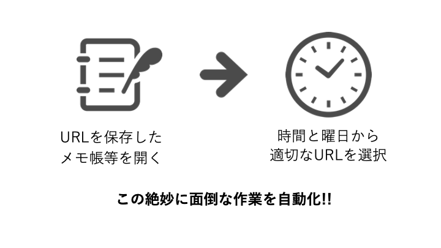
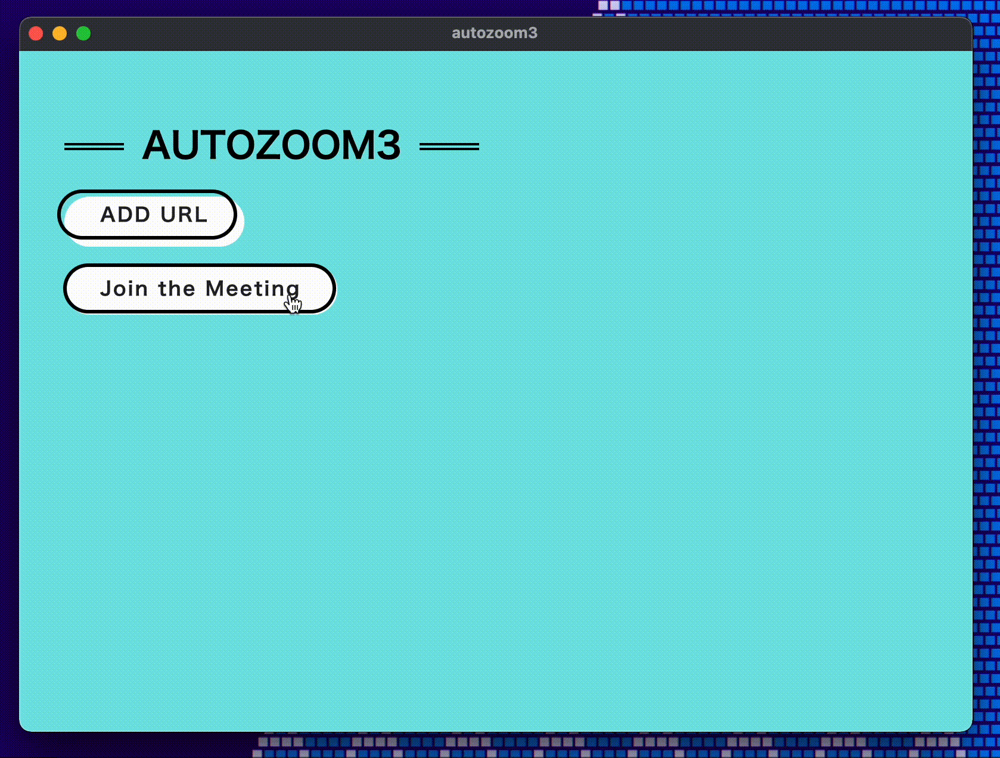

# AUTOZOOM3

AUTOZOOM3は「事前に登録しておいたURLの中から，今の曜日の今の時間に入らなければならないミーティングに自動で入れてくれる．」というアプリになっています．

## 使い方

### URLの登録

メニューからADD URLを選び，曜日，時刻，登録名，ZOOMのURLを入力してRegisterを押せばOKです！！

(登録済みのURLを消したい場合は一覧のdeleteを押すだけで消えます)

**このとき，時間についてはミーティングの開始時刻ではなく，自分が参加したい時刻にしてください**
**授業開始時刻にすると冒頭遅刻します**

> 例えば，ミーティング A が 10:00，ミーティング B が 11:00 で登録されていた場合，10:00-10:59 は A に，11:00-は B に入ります．

### ZOOMへの参加

ZOOMに参加したい時は，アプリを起動してJoin the Meetingをクリックするだけで，その曜日その時間に入るべきZOOMに入れてくれます．

## 実装と仕様

HTML+CSS+JavsScriptで作ったものをElectronでアプリ化しています．

実装方針は非常に簡単で，現在の曜日と時刻を取得してきて，保存されたURLの中から入るべきURLに飛ばすという形になっています．

その他ポイントになりうる実装・仕様としては，
* URLは，Electron内で動いているChromium上のLocalStorageに保存している
* Join the Meetingは該当URLを直に貼っているので，実は押した時ではなく起動時に入るべきURLを選択する(これは僕自身がアプリを常駐させない派なので問題を感じなかったのですが，常駐させる派からクリック時にしてほしいとの意見があったのでアップデートかけるかもです)
* 既に登録済みの曜日時刻に登録すると上書きしてしまう

あたりだと思われます．

なお，このアプリ自体「こんなのあったら便利じゃない？笑」くらいのノリでAUTOZOOMコマンドとして実装して自分で使っていたもの(初代AUTOZOOM)を友達に配布するためにGUIをつくって(AUTOZOOM2)，それをさらに良い感じにしてできたのが __AUTOZOOM3__ なので構想が雑というか作り込みが甘いのはご了承ください

# アプリの配布

https://github.com/Kakeru-Miyazaki/autozoom3/releases/tag/ver2.0.0
にて，本アプリを配布しています！

dmg,exe,debを用意しているので，Mac,Windows,Ubuntu等でお使いいただけます．

拙いアプリですが，気になった方はお試しいただけると嬉しいです！

最後まで読んでいただきありがとうございました．

kakekakemiya